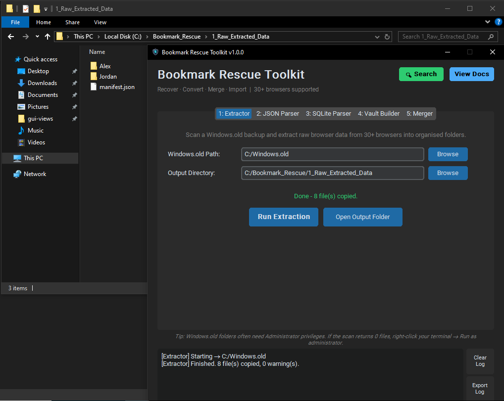

# Bookmark Rescue Toolkit

> **Recover browser bookmarks from any Windows installation - dead, upgraded, or archived.**

A forensic-grade, offline-first toolkit that scans a `Windows.old` folder or any Windows drive backup, extracts bookmark data from **30+ browsers**, and converts it into clean, portable HTML you can import into any browser, or merges it into a single file for Notion, Airtable, or Excel.

<p align="center">
  
  <br><em>Sweeping a Windows backup drive to automatically locate and extract hidden bookmark files.</em>
</p>

> **Who is this for?**
>
> - Windows users who lost bookmarks after an upgrade or reinstall  
> - IT admins and forensic techs recovering browser data from archived drives  
> - Power users who want a portable, offline bookmark vault they can take anywhere

### Windows Compatibility

The Extractor works on any NTFS‑formatted Windows drive or `Windows.old` folder. The single‑file converters, Vault Builder, Merger, and Search run on any OS as long as you provide compatible files (for example, a copied `Bookmarks` file or `places.sqlite`).

> Developed and tested on Windows 10 IoT Enterprise LTSC (presumed to be compatible with Windows 11).

---

## Features

- **One-click mass extraction**: scans every user profile on a drive across 30+ browsers simultaneously
- **Two conversion engines**: Chromium JSON and Firefox SQLite, both producing universal Netscape HTML
- **Batch vault builder**: converts everything at once and generates an offline index dashboard
- **Bookmark merger**: combines multiple browsers into one deduplicated importable file
- **CSV / JSON export**: flat export compatible with Notion, Airtable, Excel, and custom databases
- **Live search**: search by title or URL across all extracted sources instantly, no conversion needed
- **Graceful exit guard**: warns before closing if an operation is still running
- **Custom icon support**: drop `icon.ico` or `icon.png` next to `gui.py` to brand the window
- **Path persistence**: remembers your last-used folders across sessions via `config.json`
- **Portable .exe**: build a self-contained Windows executable with `python build.py`
- **Offline-first**: no telemetry, no network calls, no external services at any stage
- **Fully modular**: every engine runs as a standalone CLI tool or importable Python module

> **Note:** The portable build produces a folder named `Bookmark-Rescue-Toolkit` containing `BookmarkRescue.exe`. This folder (and the `.zip` archive) can be placed anywhere on your system or a USB drive.

---

## Repository Structure

```
Bookmark-Rescue-Toolkit/
│
├── gui.py                      # Unified GUI - run this to start
├── build.py                    # Build helper - produces the portable .exe
├── bookmark_rescue.spec        # PyInstaller spec for reproducible builds
├── requirements.txt            # pip install list (customtkinter only)
├── .gitignore
├── README.md
├── BUILDING.md                 # Step-by-step guide for building the .exe
├── LICENSE
│
├── icon.ico                    # Optional: custom .exe and window icon (Windows)
├── icon.png                    # Optional: custom window icon (fallback/all platforms)
├── config.json                 # Auto-generated at runtime - stores last-used paths
│                               # (listed in .gitignore - never committed)
│
├── core/                       # Standalone engines (importable or CLI)
│   ├── __init__.py
│   ├── utils.py                # Shared date helpers
│   ├── retriever.py            # Stage 1   - scan & extract (Tab 1)
│   ├── json_to_html.py         # Stage 2a  - Chromium JSON -> Netscape HTML (Tab 2)
│   ├── sqlite_to_html.py       # Stage 2b  - Firefox SQLite -> Netscape HTML (Tab 3)
│   ├── vault_builder.py        # Stage 3   - batch convert + dashboard (Tab 4)
│   ├── bookmark_merger.py      # Stage 4   - merge, deduplicate, CSV/JSON export (Tab 5)
│   ├── archive_beautifier.py   # CLI-only  - styled HTML5 archive (alternate output)
│   └── search.py               # Search engine - query across all sources
│
├── docs/
│   ├── GUI_WALKTHROUGH.md      # Tab-by-tab GUI guide with scenarios
│   ├── MANUAL_TOOLS.md         # CLI reference for all seven engines
│   └── CUSTOMIZATION.md        # Adding browsers, themes, icons, extending the code
│
└── assets/                     # (repo only - intentionally excluded from the portable build)
│	└── screenshots
│	    └── .gitkeep            # (empty file so git tracks the folder)
│
└── sandbox/                    # (optional contributor tool - not in dist build)
    ├── BRT_Sandbox.wsb
    ├── Launch_BRT_Sandbox.bat
    ├── sandbox_startup.bat
    ├── generate_mock_data.py
    └── SANDBOX_README.md		
```

---

## Quick Start

### Prerequisites

- Python **3.10** or newer (3.12 recommended)
- A desktop environment to run the GUI
- **Run as Administrator** on Windows when scanning a `Windows.old` folder

---

### 1. Clone the repository

```bash
git clone https://github.com/webshoppe/bookmark-rescue-toolkit.git
cd Bookmark-Rescue-Toolkit
```

---

### 2. Set up a virtual environment

**Windows:**
```bash
py -3.12 -m venv .venv
.venv\Scripts\activate
```

**macOS / Linux:**
```bash
python3 -m venv .venv
source .venv/bin/activate
```

***When you are finished working, you can deactivate the virtual environment with:***
```bash
deactivate
```

> **Tip:** Always deactivate your virtual environment when finished (`deactivate`) to avoid accidental use of the wrong Python environment.
> 
---

### 3. Install dependencies

```bash
pip install -r requirements.txt
```

The only external dependency is `customtkinter`. Everything else ships with Python's standard library.

---

### 4. Launch the application

```bash
python gui.py
```

> **Important for Extractor users:** When scanning a `Windows.old` folder or protected drive, right-click your terminal or `gui.py` and choose **"Run as administrator"**. Without elevated privileges, the Extractor may return 0 files copied due to NTFS permission restrictions.

---

### 5. Full recovery in two steps

| Step | Tab | Action |
|---|---|---|
| **1** | Tab 1 - Extractor | Set source (`C:\Windows.old`) and output folder. Click **Run Extraction**. |
| **2** | Tab 4 - Vault Builder | Set source (output from Step 1) and site folder. Click **Generate Vault Site**. |

Open `index.html` in your site folder - complete offline bookmark vault, ready.

**Need one clean importable file?** Use Tab 5 - Merger to combine and deduplicate all browsers into a single HTML file, or export to CSV/JSON.

**Converting a single file?** Use Tab 2 (Chromium JSON) or Tab 3 (Firefox SQLite) directly.

**Want to search before converting?** Click the green **Search** button in the header to search by title or URL across all extracted sources without converting anything first.

---

## Supported Browsers

### Chromium-family (JSON format)

| Browser | Variants covered |
|---|---|
| Google Chrome | Stable, Beta, Dev, Canary |
| Microsoft Edge | Stable, Beta, Dev, Canary |
| Brave | Stable, Beta, Nightly |
| Opera | Stable, GX, Beta, Developer |
| Vivaldi | Stable |
| Arc | MSIX / Windows Store |
| DuckDuckGo | WebView2 / Windows Store |
| Comet (Perplexity) | Stable |
| Ungoogled Chromium | Stable |

### Gecko-family (SQLite format)

| Browser | Notes |
|---|---|
| Firefox | Stable, Beta, Dev Edition, Nightly, ESR |
| LibreWolf | - |
| Waterfox | - |
| Pale Moon | - |
| SeaMonkey | - |
| Mullvad Browser | Installed and portable |
| Zen Browser | Both registry paths merged |
| Tor Browser | Installed and portable |

---

## CLI Quick Reference

Run all commands from the **repository root** with your virtual environment active.

```bash
# Extract from Windows.old
python -m core.retriever "C:\Windows.old" "C:\Recovery\Raw"

# Convert a single Chromium Bookmarks file
python -m core.json_to_html "Chrome_Bookmarks.json" output.html --browser "Google Chrome"

# Convert a single Firefox places.sqlite
python -m core.sqlite_to_html places.sqlite output.html --browser "Firefox"

# Build a Netscape HTML vault
python -m core.vault_builder "C:\Recovery\Raw" "C:\Recovery\Vault"

# Merge all extracted browsers into one file
python -m core.bookmark_merger --raw "C:\Recovery\Raw" -o merged.html

# Export to CSV (for Excel / Airtable / Notion)
python -m core.bookmark_merger --raw "C:\Recovery\Raw" --export-csv bookmarks.csv

# Export to JSON (for custom databases)
python -m core.bookmark_merger --raw "C:\Recovery\Raw" --export-json bookmarks.json

# Search across all extracted sources
python -m core.search --raw "C:\Recovery\Raw" "github"
python -m core.search --raw "C:\Recovery\Raw" "python -tutorial" --field title

# Build a styled HTML5 archive (CLI-only; alternate to Vault Builder)
python -m core.archive_beautifier "C:\Recovery\Raw" "C:\Recovery\Archive"
```

All tools accept `--help` for the full argument reference.

---

## Building a Portable .exe

```bash
pip install pyinstaller
python build.py --zip
```

This creates `dist/Bookmark-Rescue-Toolkit/BookmarkRescue.exe` and a versioned zip file. Place your `icon.ico` and `icon.png` in the repository root before building so they are automatically included.

See [BUILDING.md](BUILDING.md) for the full step-by-step guide, including icon setup, UPX compression, antivirus notes, and distribution instructions.

---

## Documentation

| Document | Description |
|---|---|
| [GUI Walkthrough](docs/GUI_WALKTHROUGH.md) | Tab-by-tab guide with real-world scenarios and troubleshooting |
| [Manual CLI Tools](docs/MANUAL_TOOLS.md) | Full CLI reference for all seven engines including return value schemas |
| [Customization Guide](docs/CUSTOMIZATION.md) | Adding browsers, custom icons, themes, and extending the codebase |
| [Building .exe Guide](BUILDING.md) | Step-by-step PyInstaller build guide for portable distribution |
| [Screenshot Sandbox](sandbox/SANDBOX_README.md) | Optional Windows Sandbox environment with mock data for consistent screenshots and demos |

---

## Privacy & Security

- All processing is local. No data leaves your machine.
- SQLite databases are opened in **read-only mode** - the tool cannot modify a live browser profile.
- `config.json` (saved paths) and `manifest.json` (extraction inventory) are both listed in `.gitignore` and will never be committed.
- The `.gitignore` also blocks accidental commits of recovered bookmark data, SQLite files, and generated HTML output.

---

## Contributing

1. Fork the repository
2. Create a feature branch: `git checkout -b feature/add-my-browser`
3. Add your browser to the relevant dictionary in `core/retriever.py` - see [CUSTOMIZATION.md](docs/CUSTOMIZATION.md)
4. Commit with a clear message and open a pull request

Bug reports and browser addition requests are welcome via GitHub Issues.

---

## License

MIT License - see [LICENSE](LICENSE) for details.
