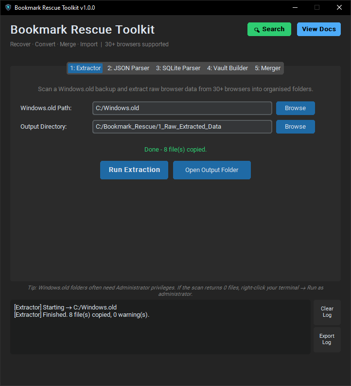
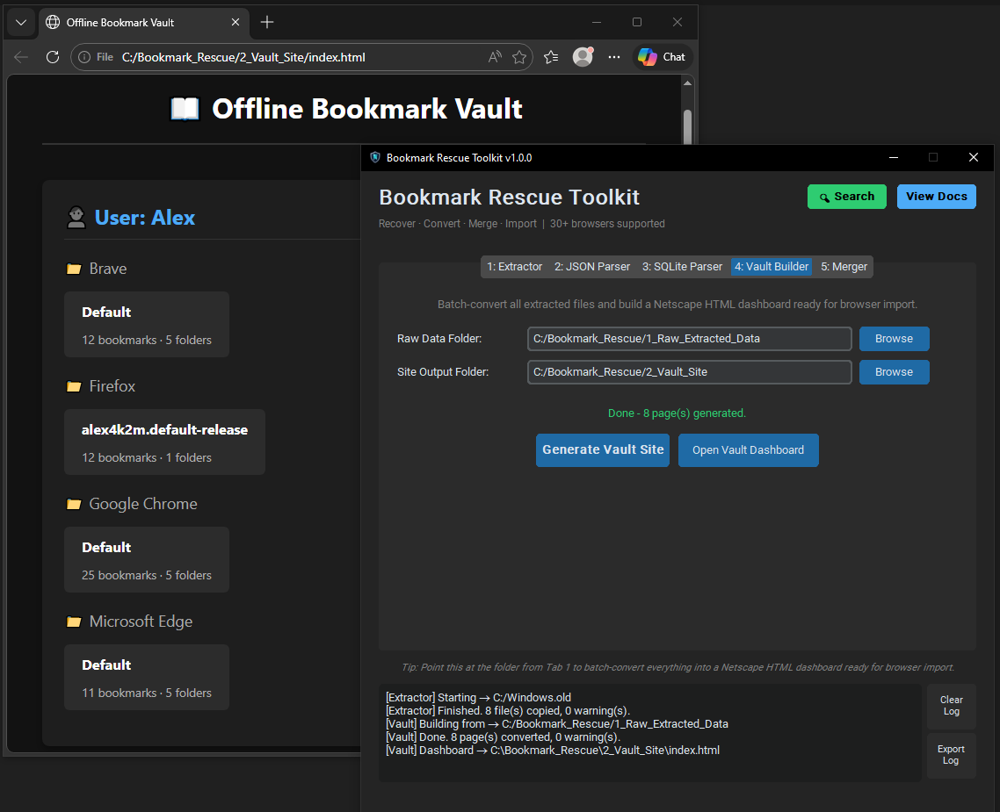
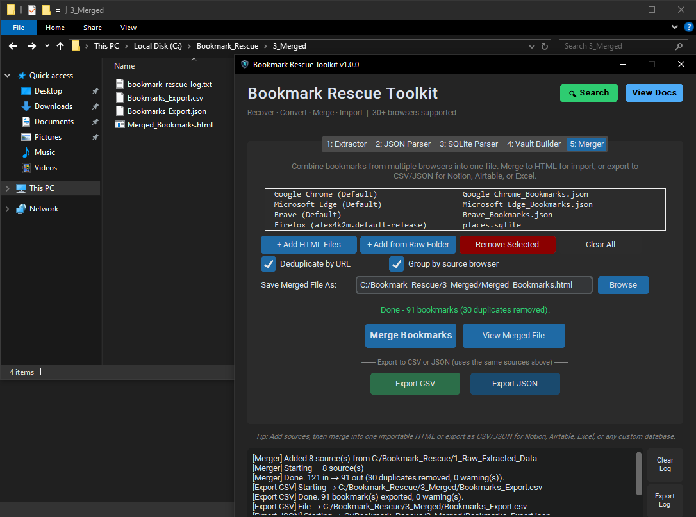
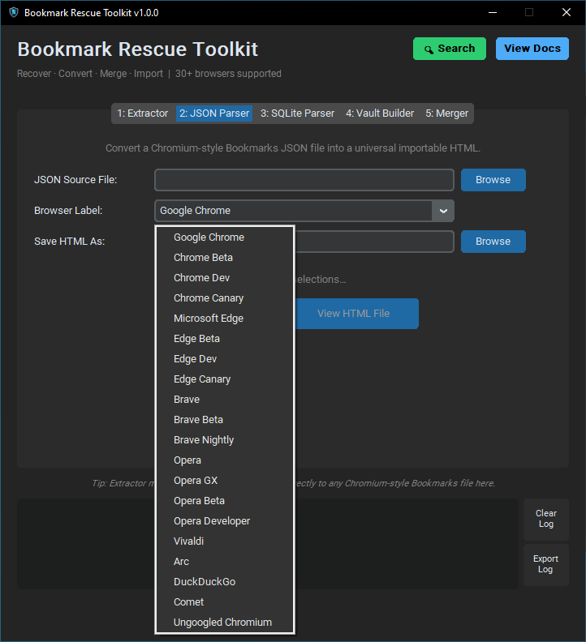
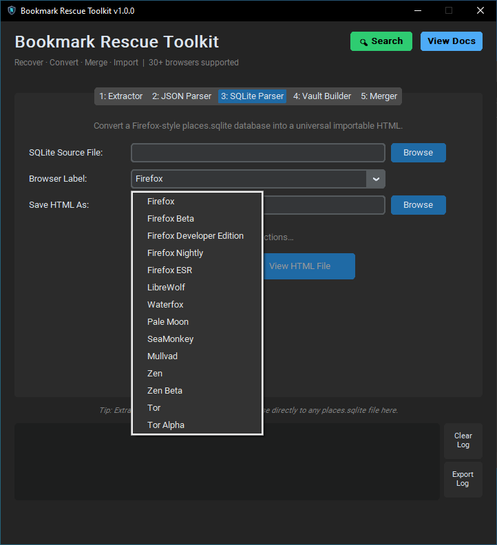
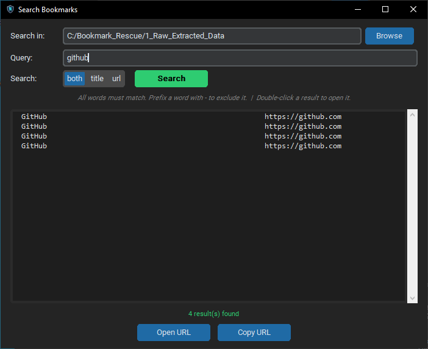
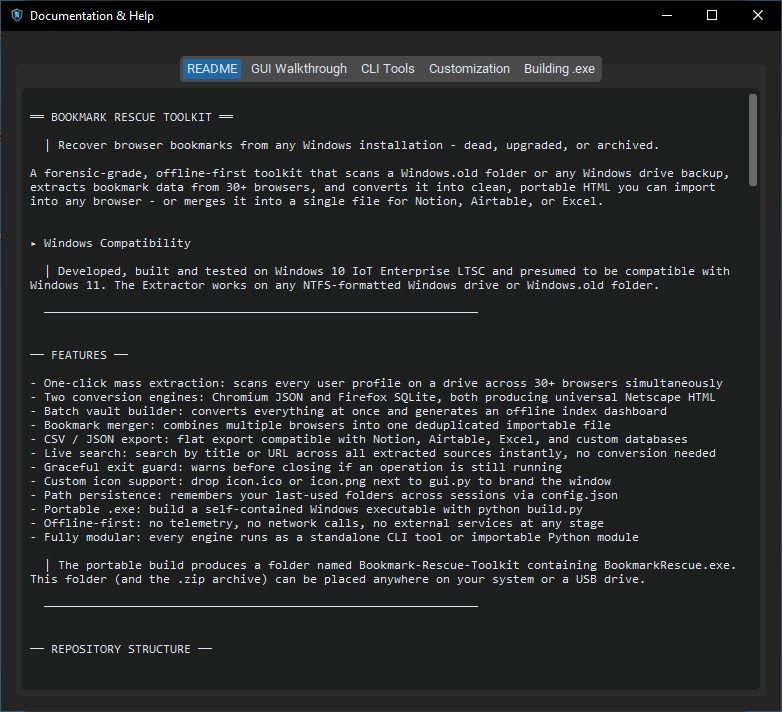

# GUI Walkthrough

This guide covers every panel of the Bookmark Rescue Toolkit GUI in detail, with real-world scenarios and troubleshooting for common issues.

## Table of contents

- [Before you begin](#before-you-begin)
  - [Getting the Application](#getting-the-application)
  - [Recommended workspace layout](#recommended-workspace-layout)
  - [Administrator privileges](#administrator-privileges)
- [Application layout](#application-layout)
  - [Status colours](#status-colours)
  - [Open / View buttons](#open--view-buttons)
- [Path A: Full recovery pipeline](#path-a-full-recovery-pipeline)
  - [Tab 1 · Extractor](#tab-1--extractor)
  - [Tab 4 · Vault Builder](#tab-4--vault-builder)
- [Path B: Merge into one file (Tab 5 · Merger)](#path-b-merge-into-one-file-tab-5--merger)
  - [Exporting to CSV or JSON](#exporting-to-csv-or-json)
- [Path C: Targeted single-file conversion](#path-c-targeted-single-file-conversion)
  - [Tab 2 · JSON Parser](#tab-2--json-parser)
  - [Tab 3 · SQLite Parser](#tab-3--sqlite-parser)
- [Search](#search)
- [View Docs](#view-docs)
- [Custom window icon](#custom-window-icon)
- [Graceful exit](#graceful-exit)
- [Common issues](#common-issues)

---

## Before You Begin

### Getting the Application

#### Option 1: Download Pre-Built Release (Recommended for most users)

1. Go to the [Releases page](https://github.com/webshoppe/Bookmark-Rescue-Toolkit/releases)
2. Download the latest `BookmarkRescue_vX.Y.Z.zip`
3. Extract the zip anywhere on your computer
4. Run `BookmarkRescue.exe` from the `Bookmark-Rescue-Toolkit` folder

No installation or Python required.

#### Option 2: Build from Source

See [BUILDING.md](../BUILDING.md) for instructions if you want to build the latest development version yourself.

### Recommended workspace layout

Create a dedicated folder before opening the app. Keeping everything in one place avoids permission conflicts with system-protected directories.

```
C:\
└── Bookmark_Rescue\
    ├── 1_Raw_Extracted_Data\     ← Extractor output (Tab 1)
    ├── 2_Vault_Site\             ← Vault Builder output (Tab 4)
    └── 3_Merged\                 ← Merger output (Tab 5)
```

> **Running the portable `.exe` vs. running from source**
>
> - If you are using `BookmarkRescue.exe` from the portable build, you do **not** need Python or a virtual environment. Only the Extractor tab requires Administrator rights when scanning protected folders.
> - If you are running from source (`python gui.py`), ensure your virtual environment is active and that your terminal is running as Administrator when using the Extractor.

> If you use the optional Windows Sandbox setup in [`../sandbox/SANDBOX_README.md`](../sandbox/SANDBOX_README.md), this exact workspace structure is created for you automatically inside the sandbox.

### Administrator privileges

When scanning a `Windows.old` folder, the tool must run as Administrator. Windows protects old user profile folders with NTFS permissions that block normal reads.

#### Option A: Run your terminal as administrator, then follow the README

1. Right‑click your terminal (Command Prompt or PowerShell) → **Run as administrator**.
2. Follow the Quick Start steps in [README](../README.md) to:
   - create and activate a virtual environment,
   - install dependencies,
   - run `python gui.py`.

#### Option B: Run the GUI directly as administrator

Right‑click `gui.py` → **Open with** → Python (as administrator).

> Without elevated privileges, the Extractor may return **0 files copied** due to NTFS permission restrictions.  
> If the Extractor completes and reports 0 files copied, this is almost always the cause. The log box will show `Permission denied` entries for each blocked folder.

When you are finished working in the terminal, you can deactivate the virtual environment with:

```bash
deactivate
```

> **Tip:** Always deactivate your virtual environment when finished (`deactivate`) to avoid accidental use of the wrong Python environment.

---

## Application Layout

```
┌──────────────────────────────────────────────────────┐
│  Bookmark Rescue Toolkit        [Search] [View Docs] │
│  Recover · Convert · Merge · Import  30+ browsers    │
│ ┌────────────────────────────────────────────────┐   │
│ │ 1:Extract 2:JSON 3:SQLite 4:Vault 5:Merger     │   │
│ │                                                │   │
│ │              (active tab content)              │   │
│ │                                                │   │
│ └────────────────────────────────────────────────┘   │
│  ↑ Contextual tip line                               │
│ ┌──────────────────────────────────┐ [Clear  Log]    │
│ │ Activity log (scrollable)        │ [Export Log]    │
│ └──────────────────────────────────┘                 │
└──────────────────────────────────────────────────────┘
```

| Element | Purpose |
|---|---|
| **🔍 Search** | Search bookmarks by title or URL across all extracted sources - no conversion needed |
| **View Docs** | Opens the README and all docs in a tabbed in-app viewer |
| **Tab tip line** | Short context-sensitive hint that changes as you switch tabs |
| **Activity log** | Appends one line per operation start, completion, and warning |
| **Clear Log** | Wipes the log display; does not affect any files on disk |
| **Export Log** | Saves the current session log to a `.txt` file |

### Status colours

| Colour | Meaning |
|---|---|
| Gray | Waiting - one or more fields still need to be filled |
| Green | Ready - all required fields are filled |
| Orange | Running - a background operation is in progress |
| Bright green | Success |
| Red | Error - see the log for the full message |

### Open / View buttons

Every tab has a secondary button that activates only after a successful run:

| Tab | Button | Opens |
|---|---|---|
| 1 · Extractor | **Open Output Folder** | Extracted files in your file manager |
| 2 · JSON Parser | **View HTML File** | Converted file in your default browser |
| 3 · SQLite Parser | **View HTML File** | Converted file in your default browser |
| 4 · Vault Builder | **Open Vault Dashboard** | `index.html` in your default browser |
| 5 · Merger | **View Merged File** | Merged HTML in your default browser |

These buttons stay inactive if the operation fails, so they never point at something that doesn't exist.

---

## Path A: Full Recovery Pipeline

### Tab 1 · Extractor

Scans every user profile on the target drive, identifies bookmark files across 30+ browsers, and copies them into an organised folder. Also writes a `manifest.json` that all downstream tools use.

**Steps:**

1. **Windows.old Path** → Browse to the root of the drive or folder to scan:
   - In-place upgrade: `C:\Windows.old`
   - Secondary drive: `D:\`
   - Mounted disk image: the image's mount point

2. **Output Directory** → Browse to `C:\Bookmark_Rescue\1_Raw_Extracted_Data`

3. Click **Run Extraction**

<p align="center">
  
  <br><em>Sweeping a Windows backup drive to automatically locate and extract hidden bookmark files.</em>
</p>

When complete, the log will show a line like:

```
[Extractor] Finished. 8 file(s) copied, 0 warning(s).
```

**Output structure:**

```
1_Raw_Extracted_Data\
    manifest.json
    Alice\
        Google Chrome\
            Default\
                Google Chrome_Bookmarks.json
        Firefox\
            abc12.default-release\
                places.sqlite
    Bob\
        Brave\
            Default\
                Brave_Bookmarks.json
```

**What gets extracted:**

| File | Used by |
|---|---|
| `Bookmarks` (JSON) | JSON Parser, Vault Builder, Merger, Search |
| `Bookmarks.bak` | Manual recovery if the primary file is corrupt |
| `places.sqlite` | SQLite Parser, Vault Builder, Merger, Search |
| `places.sqlite-wal` | Warning indicator - unclean shutdown detected |
| `favicons.sqlite` | Visual reference |
| `bookmarkbackups/*.jsonlz4` | Firefox auto-backup files |

---

### Tab 4 · Vault Builder

Reads the extracted folder, converts every artifact into Netscape Bookmark HTML, and builds an `index.html` dashboard. The Netscape format is importable by every major browser.

**Steps:**

1. **Raw Data Folder** → Select `C:\Bookmark_Rescue\1_Raw_Extracted_Data`
2. **Site Output Folder** → Select `C:\Bookmark_Rescue\2_Vault_Site`
3. Click **Generate Vault Site**

Open `2_Vault_Site\index.html` in any browser - your complete offline bookmark vault.

<p align="center">
  
  <br><em>Generating a unified, offline HTML dashboard from the extracted raw data.</em>
</p>

---

## Path B: Merge Into One File (Tab 5 · Merger)

Use Tab 5 after extraction to combine everything into a single clean importable file, with duplicates removed.

**Adding sources - two ways:**

**Option 1: Add from Raw Folder** (recommended after Tab 1):  
Click `+ Add from Raw Folder`, select your extraction output folder. The app reads `manifest.json` and adds every browser it found automatically. Each browser appears as a separate row in the source list.

**Option 2: Add HTML Files**:  
Click `+ Add HTML Files` to add individual Netscape HTML files. These can be our generated output *or* native browser exports - Chrome, Firefox, Edge, and Safari all export in this format.

**Options:**

| Checkbox | Default | Effect when checked |
|---|---|---|
| Deduplicate by URL | ✅ On | URLs already seen in an earlier source are skipped. `http://` and `https://` for the same page are treated as the same bookmark; the `https://` version is always kept in the output. |
| Group by source browser | ✅ On | Each browser's bookmarks are wrapped in a named top-level folder. Uncheck for a flat merged structure. |

<p align="center">
  
  <br><em>Consolidating multiple browser profiles into a single, deduplicated master file.</em>
</p>

**Save Merged File As** → Choose where to save the output HTML.

Click **Merge Bookmarks**. The log will show:

```
[Merger] Done. 3,412 in → 2,891 out (521 duplicates removed, 0 warning(s)).
```

### Exporting to CSV or JSON

The same source list is used for exports. Set up your sources first, then:

- **Export CSV** - produces a flat spreadsheet with columns: `title`, `url`, `folder_path`, `source`, `date_added`, `date_human`. Saved with a UTF-8 BOM so Excel displays Unicode correctly without any import wizard.
- **Export JSON** - produces an array of objects with the same fields, plus `folder_path` as a list for hierarchy-aware consumers. Compatible with Notion's CSV import, Airtable, and custom databases.

Both exports respect the **Deduplicate** checkbox. The **Group by source** setting applies only to HTML output and has no effect on CSV/JSON (both are always flat).

**Example CSV row:**
```
"Python Docs","https://docs.python.org/3/","Toolbar / Work / Dev","Google Chrome (Default)",1672531200,"January 01, 2023"
```

---

## Path C: Targeted Single-File Conversion

### Tab 2 · JSON Parser

Converts a single Chromium `Bookmarks` file to Netscape HTML.

**Example - recovering a colleague's Edge bookmarks:**

Your colleague has a USB drive with their old Edge `Bookmarks` file (no extension - that's normal for all Chromium-family browsers).

1. **JSON Source File** → Browse to the `Bookmarks` file
2. **Browser Label** → Select `Microsoft Edge` or type a custom label
3. **Save HTML As** → The dialog pre-fills a name like `Microsoft_Edge_Bookmarks.html`
4. Click **Convert to HTML**

<p align="center">
  
  <br><em>Choosing a specific Chromium-based browser profile for targeted, single-file conversion.</em>
</p>

The result imports cleanly into any browser via **Settings → Bookmarks → Import**.

---

### Tab 3 · SQLite Parser

Converts a single Firefox `places.sqlite` to Netscape HTML.

**Example - portable Tor Browser backup:**

1. **SQLite Source File** → Browse to `places.sqlite`
2. **Browser Label** → Select `Tor` or type `Tor Browser`
3. **Save HTML As** → Choose destination
4. Click **Convert to HTML**

<p align="center">
  
  <br><em>Selecting a Firefox-family browser to translate a raw database into an importable format.</em>
</p>

> **WAL journal warning:** If the log shows a WAL detection message, the browser closed uncleanly. The committed data is still fully readable - you're only potentially missing changes made in the final moments before the crash.

---

## Search

Click the green **🔍 Search** button in the header to open the search window. It works directly against the raw extracted sources - no conversion step needed.

<p align="center">
  
  <br><em>Live-searching across all extracted browser data for specific keywords without needing a full conversion.</em>
</p>

**Search in:** Pre-populated from your last extractor output path. Must point to a folder containing `manifest.json`.

**Query syntax:**

| Query | Finds |
|---|---|
| `python` | Any bookmark with "python" in title or URL |
| `python tutorial` | Must contain both words |
| `python -video` | Contains "python" but not "video" |
| `github.com` | Matches that domain in the URL |
| `recipe -youtube` | Recipes that aren't YouTube links |

**Field selector:** Switch between searching **both**, **title only**, or **url only**.

**Results:** Double-click any result to open it in your browser. Single-click to select, then use **Open URL** or **Copy URL**.

Results are capped at 500. If you hit the cap, narrow the query.

---

## View Docs

The **View Docs** button opens a resizable tabbed window with five tabs: README, GUI Walkthrough, CLI Tools, Customization and Building .exe. The window can stay open alongside the main app while you work.

<p align="center">
  
  <br><em>Accessing the built-in manuals, CLI references, and walkthroughs directly inside the app.</em>
</p>

If a doc file is missing, that tab shows the expected file path so you can identify what's wrong.

---

## Custom Window Icon

To replace the default Tkinter icon, place either file next to `gui.py`:

| File | Used on |
|---|---|
| `icon.ico` | Windows (native, preferred) |
| `icon.png` | Windows, macOS, Linux (fallback) |

On Windows, `icon.ico` is tried first. If absent, `icon.png` is used. If neither file exists, the default Tkinter icon shows silently. See [CUSTOMIZATION.md](CUSTOMIZATION.md) for recommended icon specifications.

---

## Graceful Exit

If you close the window while an operation is running (extraction, conversion, vault build, merge, or export), the app shows a confirmation dialog listing which operations are active:

```
The following operation is still running:
  • Extractor

Closing now may leave output files incomplete.
Are you sure you want to quit?
```

Click **No** to let the operation finish, or **Yes** to quit immediately. Quitting mid-extraction may leave the output folder in a partial state - the manifest will be incomplete, and the Vault Builder or Merger may miss some browsers.

---

## Common Issues

**Extractor returns 0 files copied**  
Almost always an Administrator privileges issue. Re-run as Administrator. Check the log for `Permission denied` entries showing which folders were blocked.

**"Source file not found" error**  
The path no longer resolves - the drive was unplugged or the path has a typo. Re-browse to the file.

**"Not a valid Firefox places.sqlite"**  
You've selected the wrong database. Firefox profiles contain several `.sqlite` files. Only `places.sqlite` contains bookmarks.

**Vault Builder / Merger shows 0 pages / bookmarks**  
Either the source folder is empty, `manifest.json` is missing, or you're pointing at a parent folder instead of the extraction output. The source folder should contain `manifest.json` at its root.

**Search window says "must contain manifest.json"**  
The search path points at a folder that hasn't been processed by the Extractor (Tab 1). Run extraction first.

**CSV opens with garbled characters in Excel**  
The file is encoded correctly (UTF-8 with BOM). Open Excel and use **Data → From Text/CSV** and choose UTF-8 encoding, or simply double-click the file - the BOM should handle it automatically on modern Excel versions.

**Closing the app during an operation left a partial output**  
The extraction can be safely re‑run on the same destination folder - it will overwrite the partial output.  
The Vault Builder and Merger are also **safe to re‑run** on the same inputs and destination.

**Using on macOS or Linux**  
The Extractor targets Windows‑formatted drives. Tabs 2, 3, 4, and 5, plus the Search and Docs windows, are fully cross‑platform. The **Open** / **View** buttons use the correct OS‑native opener automatically.
